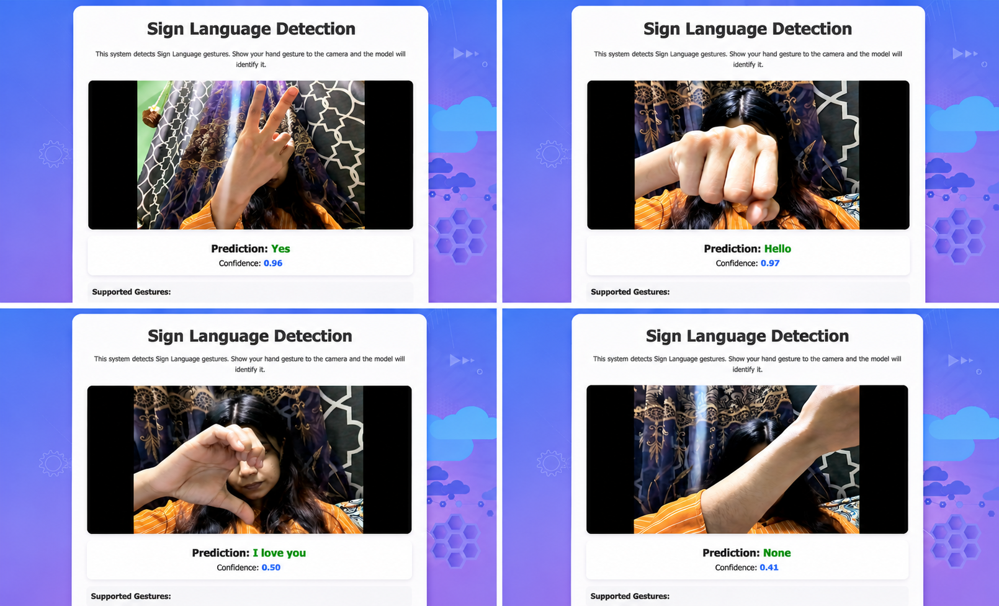

# 🤟 Real-Time Sign Language Recognition Using Machine Learning

A real-time Sign Language Recognition system developed using **Machine Learning**, **Computer Vision**, and **Python** to identify hand gestures through live webcam input and convert them into meaningful text predictions.

This project is designed to help reduce the communication gap between hearing-impaired individuals and others by providing an intelligent and interactive gesture recognition solution.
---
## 🚀 Features

* Real-time hand gesture recognition
* Live webcam-based detection
* Machine learning-powered prediction system
* Fast and responsive gesture classification
* Clean and user-friendly web interface
* Displays prediction confidence score
* Supports multiple sign gestures


---

## 📸 Project Demo



---


## 🛠️ Technologies Used

* Python
* OpenCV
* CVZone
* TensorFlow / Keras
* NumPy
* Flask
* HTML/CSS

---

## 📂 Project Structure

```bash
Real-Time-Sign-Language-Recognition-Using-Machine-Learning/
│
├── static/
├── HandSign.png
├── README.md
├── app.py
├── dataCollection.py
├── keras_model.h5
├── labels.txt
├── test.py
└── versiontest.py
```

---

## ⚙️ Installation

### Clone the Repository

```bash
git clone https://github.com/Hellopapri/Real-Time-Sign-Language-Recognition-Using-Machine-Learning.git
```

### Navigate to the Project Directory

```bash
cd Real-Time-Sign-Language-Recognition-Using-Machine-Learning
```

### Install Required Dependencies

```bash
pip install -r requirements.txt
```

### Run the Application

```bash
python app.py
```

---

## 💡 How It Works

1. The webcam captures live hand gestures
2. Hand landmarks are detected using computer vision
3. The trained machine learning model processes the gesture
4. The predicted sign is displayed with confidence score in real time

---

## 🎯 Future Improvements

* Add more sign language gestures
* Improve model accuracy
* Voice output integration
* Sentence generation support
* Mobile application deployment

---

## 🤝 Contribution

Contributions are welcome!
Feel free to fork this repository and submit pull requests.

---

## 👩‍💻 Author

**Papri Majumdar**
Data Analyst & AI Engineer

GitHub: https://github.com/Hellopapri

---

## ⭐ Support

If you like this project, give it a ⭐ on GitHub!
